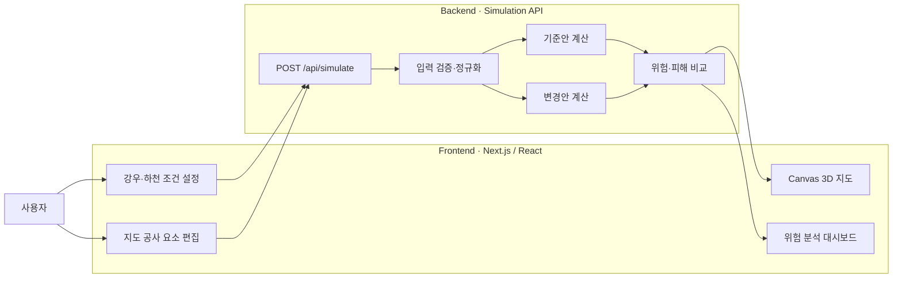

# RIVERSE

> 공사 전에 도시의 물길을 바꿔보고, 침수 위험의 변화를 비교하는 도시 수해 디지털 트윈

RIVERSE는 도로·제방·교량·하천 주변 공사와 같은 도시 구조 변경이 침수 위험에 어떤 영향을 주는지 사전에 실험하는 웹 기반 시뮬레이션 서비스입니다. 사용자는 3D 형태의 지도에서 공사 요소를 직접 배치하고, 강우와 하천 조건을 설정한 뒤 공사 전후의 침수 범위와 피해 변화를 비교할 수 있습니다.

현재 저장소에는 Google Solution Challenge 시연을 위한 풀스택 MVP가 구현되어 있습니다.

## 서비스 링크

- 비공개 배포: [RIVERSE 도시 수해 디지털 트윈](https://riverse-flood-lab.hearty-perch-7590.chatgpt.site)
- 발표 설계 문서: [presentation.md](./presentation.md)

## 문제 정의

도시 개발과 하천 주변 공사는 지면 높이, 통수 단면, 배수 경로를 변화시킵니다. 이러한 변화는 예상하지 못한 지역에 물을 집중시키거나 기존 침수 위험을 증가시킬 수 있지만, 기존 수리 모델은 전문 지식과 복잡한 입력 데이터가 필요해 초기 의사결정 단계에서 활용하기 어렵습니다.

RIVERSE는 이 문제를 다음과 같이 해결하고자 합니다.

1. 복잡한 모델 입력 대신 지도에서 공사 요소를 직접 배치합니다.
2. 동일한 재난 조건에서 기준안과 공사 변경안을 각각 계산합니다.
3. 침수 확산을 시간에 따른 애니메이션으로 보여줍니다.
4. 위험도와 피해량의 증감을 한 화면에서 비교합니다.
5. 위험이 커질 경우 다른 대안을 즉시 배치하고 다시 분석합니다.

## 주요 기능

### 재난 조건 설정

- 시간당 강우량: `10~180 mm/h`
- 강우 지속시간: `30~360분`
- 상류 유량: `100~2,000 ㎥/s`
- 하류 수위: `0~3m`
- 태풍급 복합 홍수 및 도심 집중호우 프리셋

### 도시 구조 편집

- **제방:** 선택 지역의 침수 위험을 낮추고 주변 수위 변화를 반영합니다.
- **굴착:** 하도를 확장하거나 지형을 낮추는 효과를 적용합니다.
- **배수:** 저지대 배수 능력을 높이는 효과를 적용합니다.
- **공사:** 통수 단면을 차단해 상류 위험이 증가하는 상황을 재현합니다.
- 실행 취소 및 시나리오 초기화를 지원합니다.

### 침수 결과 시각화

- 32×22, 총 704개 격자로 구성된 등각 3D 지도
- 수심에 따른 청록색~남색 침수 표현
- 3시간 동안의 침수 확산 재생 및 시간 탐색
- 지도 격자 선택 시 최대 수심과 침수 도달시간 확인

### 공사 전후 영향 비교

- 종합 위험도 `0~100점`
- 최대 침수 수심
- 전체 침수 면적
- 영향받는 건물 수
- 침수에 노출된 도로 길이
- 최초 침수 도달시간
- 기준안 대비 상대 피해액 변화

## 화면 구성

```text
┌──────────────────────────────────────────────────────────────────────────┐
│ RIVERSE │ 분석 대상 시나리오                     │ 초기화 │ 분석 실행 │
├──────────────┬────────────────────────────────────┬──────────────────────┤
│ 조건 설정    │ 3D 침수 시뮬레이션 지도           │ 분석 결과            │
│              │                                    │                      │
│ 강우량       │ 조회 · 제방 · 굴착 · 배수 · 공사  │ 종합 위험도          │
│ 지속시간     │                                    │ 최대 수심·침수 면적  │
│ 상류 유량    │ 공사 요소 배치 및 침수 애니메이션 │ 건물·도로 영향       │
│ 하류 수위    │                                    │ 공사 전후 비교       │
│ 프리셋       │                                    │ 우선 확인 지점       │
├──────────────┴────────────────────────────────────┴──────────────────────┤
│                 재생 │ 00:00 ━━━━━●━━━━ 03:00 │ 수심 범례              │
└──────────────────────────────────────────────────────────────────────────┘
```

## 시스템 아키텍처



## 데이터 처리 흐름

1. 사용자가 강우량, 지속시간, 상류 유량, 하류 수위를 설정합니다.
2. 지도에서 제방, 굴착, 배수구 또는 공사 차단 위치를 선택합니다.
3. 프론트엔드가 조건과 공사 요소의 격자 좌표를 API에 전송합니다.
4. 백엔드가 값의 범위와 공사 요소 형식을 검증합니다.
5. 공사 요소가 없는 기준 시나리오와 변경 시나리오를 각각 계산합니다.
6. 각 격자의 최대 수심과 침수 도달 단계를 생성합니다.
7. 위험도, 침수 면적, 건물·도로 영향과 피해 증감치를 계산합니다.
8. 프론트엔드가 계산 결과를 지도 애니메이션과 분석 패널에 표시합니다.

## 기술 구성

| 영역 | 기술 | 역할 |
|---|---|---|
| 웹 프레임워크 | Next.js, React, TypeScript | 화면과 API 구성 |
| 빌드·런타임 | vinext, Vite | Cloudflare Worker 호환 빌드 |
| 지도 표현 | HTML Canvas 2D | 등각 3D 지형과 침수 애니메이션 렌더링 |
| 스타일 | CSS, Tailwind CSS 기반 환경 | 반응형 대시보드 UI |
| 백엔드 | Next.js Route Handler | 입력 검증과 침수 계산 API 제공 |
| 배포 | Codex Sites | 비공개 프로덕션 배포 |
| 테스트 | Node.js Test Runner | 서버 렌더링 및 API 결과 검증 |

## 프로젝트 구조

```text
GoogleSolution/
├─ app/
│  ├─ api/simulate/route.ts   # 침수 계산 API
│  ├─ flood-lab.tsx           # 메인 시뮬레이션 대시보드
│  ├─ globals.css             # 전체 UI 및 반응형 스타일
│  ├─ layout.tsx              # 메타데이터와 공통 레이아웃
│  └─ page.tsx                # 메인 페이지 진입점
├─ public/
│  └─ og.png                  # 링크 공유용 소셜 이미지
├─ tests/
│  └─ rendered-html.test.mjs  # 화면 및 API 자동 테스트
├─ .openai/
│  └─ hosting.json            # Sites 배포 설정
├─ presentation.md            # 아키텍처와 발표 준비 문서
├─ package.json
└─ README.md
```

## 로컬 실행 방법

### 요구사항

- Node.js `22.13.0` 이상
- npm

### 설치 및 실행

```bash
npm install
npm run dev
```

브라우저에서 `http://localhost:3000`으로 접속합니다.

Windows PowerShell의 실행 정책으로 `npm` 실행이 차단되는 경우 다음과 같이 실행할 수 있습니다.

```powershell
npm.cmd install
npm.cmd run dev
```

### 빌드 및 테스트

```bash
npm run build
npm test
```

- `npm run build`: 배포 가능한 vinext 결과물을 생성합니다.
- `npm test`: 프로젝트를 빌드한 뒤 메인 화면의 서버 렌더링과 시뮬레이션 API를 검증합니다.

## 시뮬레이션 API

### 요청

`POST /api/simulate`

```json
{
  "rainfall": 110,
  "duration": 180,
  "discharge": 1050,
  "tide": 0.9,
  "interventions": [
    {
      "id": "construction-1",
      "type": "blockage",
      "x": 18,
      "y": 11
    }
  ]
}
```

공사 요소의 `type`은 다음 값 중 하나입니다.

| 값 | 의미 |
|---|---|
| `levee` | 제방 설치 |
| `excavation` | 하도 굴착·확장 |
| `culvert` | 배수구 추가 |
| `blockage` | 공사로 인한 통수 차단 |

### 응답 구조

```json
{
  "cells": [
    {
      "x": 0,
      "y": 0,
      "elevation": 8.42,
      "depth": 0.31,
      "arrival": 7
    }
  ],
  "grid": {
    "width": 32,
    "height": 22,
    "cellMeters": 50
  },
  "metrics": {
    "maxDepth": 2.2,
    "floodedArea": 0.85,
    "affectedBuildings": 7,
    "exposedRoads": 2.1,
    "firstArrivalMinutes": 60,
    "riskScore": 52,
    "estimatedDamage": 26
  },
  "comparison": {
    "baselineRisk": 45,
    "deltaRisk": 7,
    "baselineDamage": 18,
    "deltaDamage": 8
  },
  "model": "RIVERSE rapid-grid v0.1"
}
```

## 현재 모델의 범위와 한계

현재 `RIVERSE rapid-grid v0.1`은 서비스 아이디어와 공사 전후 비교 경험을 검증하기 위한 **상대 위험 모델**입니다.

- 냉천 하류를 가정해 생성한 가상 50m 격자를 사용합니다.
- 실제 하천 단면, 배수관망, 펌프장 용량을 아직 반영하지 않습니다.
- 피해액은 실제 손실액이 아니라 시나리오 간 비교를 위한 상대 지표입니다.
- 결과는 공식 재난 예측, 구조물 안전 검토 또는 방재 의사결정에 직접 사용할 수 없습니다.
- 실제 서비스 전환 시 과거 침수 사례를 이용한 보정과 전문가 검증이 필요합니다.

## 향후 개발 계획

### 실제 공간·기상 데이터 연결

- 국토지리정보원 DEM 기반 실제 지형 생성
- 하천 단면, 제방, 교량 및 암거 데이터 적용
- 기상청 강우와 WAMIS 수위·유량 데이터 연동
- 배수관망과 펌프장 용량 반영
- Google Earth Engine을 이용한 과거 위성 침수 범위 검증

### 정밀 시뮬레이션

- HEC-RAS 2D 등 검증된 수리 모델과 연동
- 정밀 모델의 결과를 학습한 빠른 AI 대리 모델 개발
- 다수의 강우·수위 조합을 이용한 침수 확률 산출
- 최대 수심뿐 아니라 유속과 위험 도달시간 제공

### 사용자 기능

- Google 3D Tiles 또는 Cesium 기반 실제 도시 지도
- 선·면 단위 제방과 공사 영역 편집
- 시나리오 저장, 불러오기 및 공유
- 공사 대안 자동 비교와 위험 최소화안 추천
- 결과 보고서 PDF·이미지 내보내기
- 병원, 학교, 대피소 등 주요 시설 영향 분석

## 관련 지속가능발전목표

- **SDG 11 — 지속가능한 도시와 공동체:** 도시계획 단계에서 재난 위험을 사전에 검토합니다.
- **SDG 13 — 기후행동:** 극한 강우 증가에 대응하는 적응형 도시계획을 지원합니다.

## 핵심 메시지

RIVERSE는 홍수가 발생한 뒤 피해를 보여주는 지도가 아니라, **도시를 바꾸기 전에 물이 어떻게 움직일지를 먼저 시험하는 의사결정 도구**입니다.
