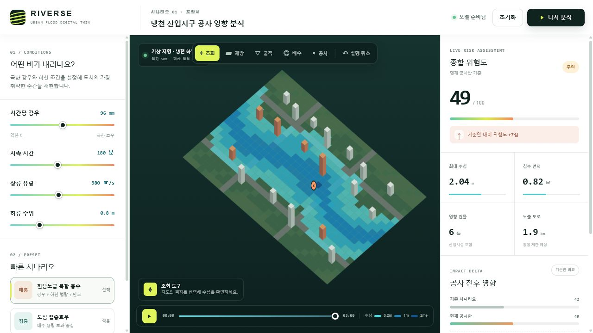
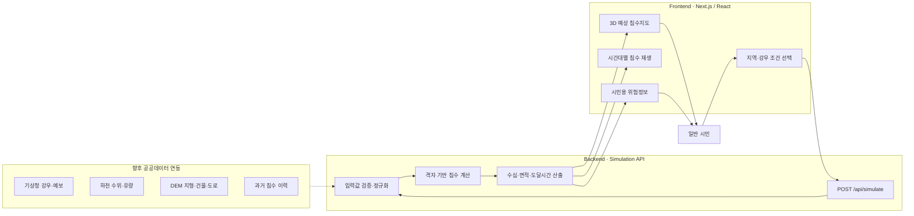

# RIVERSE

> 비가 오기 전, 우리 동네에서 어디가 잠길 수 있는지 미리 확인하는 시민용 침수 위험 예측 서비스

RIVERSE는 일반 시민이 복잡한 재난 데이터를 몰라도 강우와 하천 상황에 따른 **예상 침수지역, 최대 수심, 침수 도달시간, 도로·건물 위험**을 한눈에 확인할 수 있도록 만든 웹 서비스입니다.

사용자는 비의 세기와 지속시간을 선택하고 3D 지도에서 물이 퍼지는 과정을 확인할 수 있습니다. 이를 통해 출퇴근·등하교·차량 이동 전에 위험 지역을 피하고, 침수가 예상될 때 더 빠르게 대비할 수 있습니다.

현재 저장소에는 Google Solution Challenge 시연을 위한 풀스택 MVP가 구현되어 있습니다.

## 프로젝트 목표

홍수위험지도, 기상정보, 하천 수위와 같은 재난 정보는 여러 기관에 분산되어 있고 전문 용어가 많아 일반 시민이 자신의 생활권 위험을 즉시 이해하기 어렵습니다. 비가 많이 오는 순간에도 다음과 같은 질문에 빠르게 답하기 어렵습니다.

- 우리 동네에서 어느 지역이 먼저 침수될까?
- 도로에 물이 얼마나 깊게 찰 수 있을까?
- 침수가 시작되기까지 얼마나 시간이 남았을까?
- 차량이나 보행으로 지나가기 위험한 곳은 어디일까?
- 강우가 더 강해지면 위험 범위가 얼마나 넓어질까?

RIVERSE는 흩어진 재난 정보를 시민이 이해하기 쉬운 지도와 숫자로 변환해, **침수 전에 위험을 인지하고 안전한 행동을 준비하는 것**을 목표로 합니다.

## 핵심 사용자

- 집중호우가 예상되는 지역의 주민
- 출퇴근·등하교 경로의 침수 위험을 확인하려는 시민
- 지하주차장, 반지하, 저지대 건물 이용자
- 차량 침수와 도로 통제를 미리 확인하려는 운전자
- 가족이 거주하는 지역의 위험을 대신 확인하려는 보호자

## 시민 이용 흐름

1. 확인하려는 지역과 강우 시나리오를 선택합니다.
2. 시간당 강우량과 비가 지속되는 시간을 설정합니다.
3. 지도에서 시간에 따라 넓어지는 예상 침수지역을 확인합니다.
4. 최대 수심, 침수 면적, 위험 도로와 영향 건물을 확인합니다.
5. 위험한 시간과 장소를 피해 이동 또는 대피를 준비합니다.

> 현재 MVP는 포항시 냉천 하류를 가정한 예시 지형을 사용합니다. 실제 서비스에서는 주소·현재 위치 검색과 전국 단위 지형 데이터를 연결할 예정입니다.

## 주요 기능

### 강우·하천 상황 설정

- 시간당 강우량: `10~180 mm/h`
- 강우 지속시간: `30~360분`
- 상류 유량: `100~2,000 ㎥/s`
- 하류 수위: `0~3m`
- 태풍급 복합 홍수와 도심 집중호우 시나리오

전문적인 수문 데이터를 직접 입력하지 않아도 대표 시나리오를 선택해 위험을 확인할 수 있습니다.

### 예상 침수지역 확인

- 32×22, 총 704개 격자로 표현한 등각 3D 지도
- 수심이 낮은 지역은 청록색, 깊은 지역은 남색으로 구분
- 3시간 동안 물이 퍼지는 과정을 애니메이션으로 재생
- 지도 격자 선택 시 해당 위치의 최대 수심과 도달시간 표시

### 시민용 위험 정보

- 종합 침수 위험도 `0~100점`
- 예상 최대 수심
- 전체 예상 침수 면적
- 침수 영향을 받을 수 있는 건물 수
- 통행이 어려울 수 있는 도로 길이
- 최초 침수 예상시간
- 우선적으로 확인해야 할 위험 지점

### 다양한 상황 비교

시민은 강우량, 지속시간, 하천 유량과 수위를 바꾸면서 평상시 호우와 극한호우의 차이를 비교할 수 있습니다. 이를 통해 비가 더 강해졌을 때 침수 범위가 어디까지 확대되는지 직관적으로 확인할 수 있습니다.

## 화면 구성



현재 화면은 다음 세 영역으로 구성됩니다.

| 영역 | 시민이 확인하는 내용 |
|---|---|
| 왼쪽 조건 패널 | 강우량, 지속시간, 상류 유량, 하류 수위 |
| 중앙 3D 지도 | 시간에 따라 변하는 예상 침수지역과 수심 |
| 오른쪽 결과 패널 | 위험도, 최대 수심, 침수 면적, 건물·도로 영향 |

## 시스템 아키텍처



## 데이터 처리 흐름

1. 시민이 지역과 강우 조건을 선택합니다.
2. 프론트엔드가 강우량, 지속시간, 하천 유량과 수위를 API에 전송합니다.
3. 백엔드가 입력값의 범위를 검사하고 계산 가능한 값으로 정규화합니다.
4. 격자별 지형 높이와 하천까지의 거리를 이용해 물의 확산을 계산합니다.
5. 각 위치의 최대 수심과 침수 도달시간을 생성합니다.
6. 침수 면적, 영향 건물, 위험 도로와 종합 위험도를 계산합니다.
7. 프론트엔드가 결과를 3D 지도, 타임라인과 시민용 위험정보로 표시합니다.

## 기술 구성

| 영역 | 기술 | 역할 |
|---|---|---|
| 웹 프레임워크 | Next.js, React, TypeScript | 시민용 화면과 API 구성 |
| 빌드·런타임 | Next.js 개발·프로덕션 서버 | 로컬 실행 및 빌드 |
| 지도 표현 | HTML Canvas 2D | 등각 3D 지형과 침수 애니메이션 렌더링 |
| 스타일 | CSS, Tailwind CSS 기반 환경 | 반응형 대시보드 UI |
| 백엔드 | Next.js Route Handler | 입력 검증과 침수 계산 API 제공 |
| 실행 환경 | Node.js | 로컬 개발·시연 서버 |
| 테스트 | Node.js Test Runner | 핵심 화면과 API 결과 검증 |

## 프로젝트 구조

```text
GoogleSolution/
├─ app/
│  ├─ api/simulate/route.ts   # 침수 계산 API
│  ├─ flood-lab.tsx           # 메인 침수위험 확인 화면
│  ├─ globals.css             # 전체 UI 및 반응형 스타일
│  ├─ layout.tsx              # 메타데이터와 공통 레이아웃
│  └─ page.tsx                # 메인 페이지 진입점
├─ public/
│  ├─ og.png                  # 링크 공유용 소셜 이미지
│  └─ readme-preview.png      # README용 로컬 실행 화면
├─ tests/
│  └─ rendered-html.test.mjs  # 화면 및 API 자동 테스트
├─ presentation.md            # 아키텍처와 발표 준비 문서
├─ package.json
└─ README.md
```

## 로컬 실행 방법

### 요구사항

- Node.js `22.13.0` 이상
- npm

### 설치 및 실행

```bash
npm install
npm run dev
```

브라우저에서 `http://localhost:3000`으로 접속합니다.

Windows PowerShell의 실행 정책으로 `npm` 실행이 차단되는 경우 다음과 같이 실행할 수 있습니다.

```powershell
npm.cmd install
npm.cmd run dev
```

### 빌드 및 테스트

```bash
npm run build
npm test
```

- `npm run build`: Next.js 프로덕션 빌드 결과물을 생성합니다.
- `npm test`: 프로젝트를 빌드한 뒤 핵심 화면 구성과 시뮬레이션 API를 검증합니다.

## 시뮬레이션 API

### 요청

`POST /api/simulate`

```json
{
  "rainfall": 110,
  "duration": 180,
  "discharge": 1050,
  "tide": 0.9
}
```

### 주요 응답

```json
{
  "grid": {
    "width": 32,
    "height": 22,
    "cellMeters": 50
  },
  "metrics": {
    "maxDepth": 1.62,
    "floodedArea": 0.73,
    "affectedBuildings": 5,
    "exposedRoads": 1.6,
    "firstArrivalMinutes": 60,
    "riskScore": 45
  },
  "model": "RIVERSE rapid-grid v0.1"
}
```

실제 응답에는 지도 애니메이션을 위한 격자별 높이, 최대 수심과 침수 도달 단계가 함께 포함됩니다.

## 현재 모델의 범위와 한계

현재 `RIVERSE rapid-grid v0.1`은 시민용 침수위험 확인 경험을 검증하기 위한 **상대 위험 모델**입니다.

- 포항시 냉천 하류를 가정해 생성한 가상 50m 격자를 사용합니다.
- 실제 주소나 GPS 위치 검색 기능은 아직 제공하지 않습니다.
- 실시간 기상청 예보, 하천 관측값과 배수관망을 아직 직접 연동하지 않습니다.
- 화면의 수심과 도달시간은 실제 재난예보가 아닌 시나리오 기반 예상값입니다.
- 결과만으로 통행이나 대피 여부를 결정해서는 안 되며, 실제 재난 상황에서는 정부·지자체의 재난문자와 통제 안내를 우선해야 합니다.
- 실제 서비스 전환 전 공공데이터 적용, 과거 침수 사례 보정과 전문가 검증이 필요합니다.

## 향후 개발 계획

### 실제 위치·재난 데이터 연결

- 주소와 현재 위치 기반 동네 검색
- 국토지리정보원 DEM 기반 실제 지형 생성
- 기상청 실황·단기예보 자동 연동
- 하천 수위·유량과 도시 배수관망 반영
- 과거 침수지역과 홍수위험지도 중첩
- Google Earth Engine을 이용한 위성 침수 범위 검증

### 시민 안전 기능

- 현재 위치 주변의 예상 침수 깊이 알림
- 시간대별 침수 예상지역 변화 제공
- 침수 도로를 피하는 안전 이동경로 안내
- 가까운 대피소, 병원과 고지대 정보 제공
- 가족이 등록한 지역의 위험 알림
- 고령자와 저시력 사용자를 위한 큰 글씨·고대비 모드

### 예측 정확도 개선

- HEC-RAS 2D 등 검증된 수리 모델 연동
- 과거 관측 결과와 예측 결과의 오차 측정
- 정밀 모델 결과를 빠르게 제공하는 AI 대리 모델 개발
- 다수의 기상 시나리오를 이용한 침수 가능성 표현
- 최대 수심뿐 아니라 유속과 위험 지속시간 제공

## 관련 지속가능발전목표

- **SDG 11 — 지속가능한 도시와 공동체:** 시민이 생활권의 재난 위험을 쉽게 이해하고 더 빠르게 대비하도록 지원합니다.
- **SDG 13 — 기후행동:** 극한호우가 증가하는 환경에서 지역별 기후재난 적응을 돕습니다.

## 핵심 메시지

RIVERSE는 전문가만 이해할 수 있는 재난 데이터를 시민의 언어로 바꾸어, **비가 오기 전에 우리 동네에서 어디가 위험한지 미리 확인하고 대비하도록 돕는 서비스**입니다.
