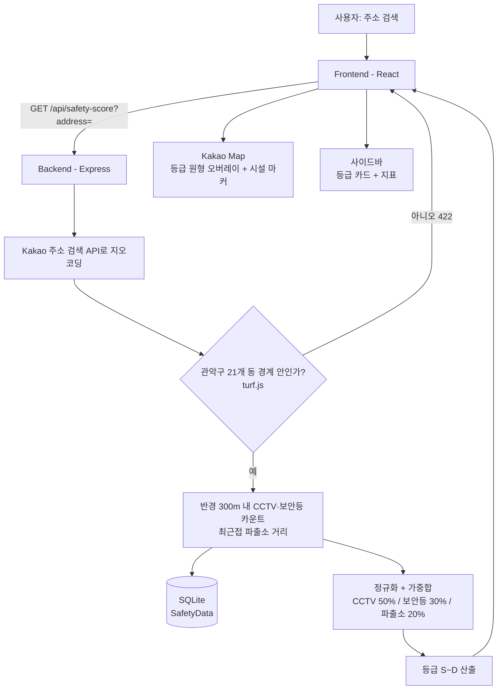

# 2026_GDGoC_SCH — 관악 안심지도

주소 하나로 우리 동네의 CCTV·보안등·파출소 밀집도를 확인하고, 실시간 안전등급(S~D)을 받아보는 1인 가구를 위한 관악구 안심 주거 서비스입니다.

## 📌 프로젝트 소개

- **문제**: 1인 가구가 이사·자취를 결정할 때, 그 동네가 실제로 밤에 안전한지 판단할 객관적인 정보가 부족합니다. 막연한 후기나 감에 의존하게 됩니다.
- **해결 방법**: 관악구 공공데이터(CCTV, 보안등, 파출소 위치)를 기반으로, 검색한 주소 반경 300m 내 안전 인프라 밀집도를 서버에서 실시간 계산해 S~D 등급으로 정량화해 보여줍니다. 같은 동 안에서도 위치마다 다른 점수가 나옵니다.
- **주요 기능**: 아래 참고

## ✨ 주요 기능

- 주소 검색 기반 실시간 안전점수·등급(S~D) 계산
- 반경 300m 내 CCTV·보안등 개수, 최근접 파출소 거리 분석
- Kakao Map 지도 시각화 — 등급 원형 오버레이, 주변 시설 마커, 시설 타입별 필터
- 온보딩(이름·나이·성별, 거주 동 등록) 및 최근 검색 기록(최대 6건)
- 백엔드 미연결 시 데모(mock) 데이터로 자동 폴백해 시연 안정성 확보

## 🖥️ 서비스 화면

> 스크린샷/GIF 추가 예정

## 🛠️ 기술 스택

| 영역 | 스택 |
|---|---|
| Frontend | React 19, Vite, Kakao Maps JS SDK |
| Backend | Node.js, Express 5 |
| Database | Prisma ORM + SQLite |
| 외부 API | Kakao 주소 검색(Geocoding) REST API |
| 기타 | turf.js (관악구 경계 point-in-polygon 판별) |

지도 렌더링은 Kakao Maps JS SDK(`VITE_KAKAO_MAP_KEY`)를 사용합니다. 이전에는 Leaflet/OpenStreetMap을 썼으나 전환 완료했습니다.

## 🏗️ 프로젝트 구조

```
frontend/            React (Vite)
  src/components/
    Onboarding/       프로필·주소 입력 온보딩 2단계
    Main/             메인 화면(topbar + 사이드바 + 지도)
  src/api/            백엔드 API 클라이언트 (safetyApi.js)
  src/utils/          목업 안전점수 로직 (mockSafety.js, 백엔드 폴백용)
  src/styles/         디자인 토큰 + 공통 스타일

backend/             Express + Prisma(SQLite)
  src/routes/          라우트 (지오코딩, 관악구 범위 판별)
  src/controllers/     요청 처리
  src/services/        점수 계산(카운트·정규화·등급)
  src/utils/           거리 계산
  prisma/              스키마, 마이그레이션, CSV 임포트/지오코딩 스크립트, 데이터 파일

database/            초기 설계 스케치(schema.sql) — 실제 구현은 Prisma/SQLite 사용, 미연동
```

## 🔄 데이터 흐름


```mermaid
flowchart TD
    A[사용자: 주소 검색] --> B[Frontend - React]
    B -->|"GET /api/safety-score?address="| C[Backend - Express]
    C --> D[Kakao 주소 검색 API로 지오코딩]
    D --> E{관악구 21개 동 경계 안인가?<br/>turf.js}
    E -- 아니오 422 --> B
    E -- 예 --> F[반경 300m 내 CCTV·보안등 카운트<br/>최근접 파출소 거리]
    F --> G[(SQLite<br/>SafetyData)]
    F --> H[정규화 + 가중합<br/>CCTV 50% / 보안등 30% / 파출소 20%]
    H --> I[등급 S~D 산출]
    I --> B
    B --> J[Kakao Map<br/>등급 원형 오버레이 + 시설 마커]
    B --> K[사이드바<br/>등급 카드 + 지표]
```

백엔드가 꺼져있거나 오류가 나면(네트워크 실패·500), 프론트는 alert으로 알린 뒤 `mockSafety.js`의 결정적 목업 데이터로 자동 폴백합니다. 주소를 못 찾거나(404) 관악구 밖(422)인 경우는 폴백하지 않고 실제 에러를 그대로 보여줍니다.

## 🚀 실행 방법

처음 한 번만:

```
npm run install:all
```

아래 "환경 변수 설정", "데이터베이스" 섹션을 먼저 진행한 뒤, 두 서버를 동시에 실행:

```
npm run dev
```

- 백엔드: http://localhost:4000 (PORT 환경변수로 변경 가능)
- 프론트엔드: http://localhost:5173

개별 실행도 가능합니다.

```
npm run dev:backend
npm run dev:frontend
```

## ⚙️ 환경 변수 설정

**`backend/.env`**

```
DATABASE_URL="file:./dev.db"
KAKAO_API_KEY=발급받은_Kakao_REST_API_키
PORT=4000
```

- `KAKAO_API_KEY`: [Kakao Developers](https://developers.kakao.com)에서 애플리케이션 생성 → **REST API 키** 발급 (주소 검색/지오코딩용). 비워두면 `/api/safety-score`가 항상 500을 반환합니다.
- `PORT`: 생략 시 기본 4000. 로컬에 이미 4000번 포트를 쓰는 프로세스(Docker/WSL 등)가 있으면 다른 값으로 지정하세요.

**`frontend/.env`**

```
VITE_API_URL=http://localhost:4000
VITE_KAKAO_MAP_KEY=발급받은_Kakao_JavaScript_키
```

- `VITE_API_URL`: 백엔드 주소. `backend/.env`의 `PORT`를 바꿨다면 이 값도 맞춰야 합니다.
- `VITE_KAKAO_MAP_KEY`: Kakao Developers의 **JavaScript 키**(REST API 키와 다름). 지도 렌더링에 실제로 사용되므로 비워두면 지도가 뜨지 않습니다.

## 🗄️ 데이터베이스

Prisma + SQLite. DB 파일은 `backend/prisma/dev.db`, 스키마는 `backend/prisma/schema.prisma`에서 관리합니다.

```
# 스키마 수정 후 마이그레이션
cd backend && npm run prisma:migrate

# Prisma 클라이언트 재생성
cd backend && npm run prisma:generate

# DB GUI로 데이터 보기
cd backend && npm run prisma:studio
```

**최초 세팅 시 데이터 채우기 (순서대로)**

```
cd backend
npx prisma migrate dev
npm run import:safety-data          # 관악구 CCTV/보안등/파출소/범죄통계 CSV 15,399건 임포트
node prisma/geocodePoliceStations.js  # 파출소 9건 좌표 지오코딩 (KAKAO_API_KEY 필요)
```

마지막 지오코딩 스크립트를 건너뛰면 파출소 거리(`policeDistanceMeters`)가 항상 `null`로 나옵니다.

## 📡 API

| Method | Path | 설명 |
|---|---|---|
| GET | `/api/health` | 헬스체크 |
| GET | `/api/users`, POST `/api/users` | 초기 세팅 검증용 CRUD |
| GET | `/api/safety-data` | CCTV/보안등/파출소/범죄통계 원본 데이터 조회 (`dataType`/`page`/`pageSize` 쿼리) |
| GET | `/api/safety-score?address=` | **핵심 API.** 주소 → 실시간 안전점수/등급 |

### `GET /api/safety-score?address=...`

**응답 예시**
```json
{
  "address": "서울시 관악구 신림동",
  "lat": 37.489,
  "lng": 126.926,
  "grade": "A",
  "score": 72,
  "details": { "radiusMeters": 300, "cctvCount": 34, "lampCount": 293, "policeDistanceMeters": 817 },
  "meta": { "phase": 2, "method": "radius", "note": "..." }
}
```

**에러 응답**

| 상태 코드 | 의미 |
|---|---|
| 400 | `address` 쿼리 누락 |
| 404 | Kakao 지오코딩 결과 없음 (존재하지 않는 주소) |
| 422 | 좌표는 나왔지만 관악구 범위 밖 |
| 500 | 서버 내부 오류 (예: `KAKAO_API_KEY` 미설정) |

관련 코드: `backend/src/routes/safety.routes.js`(지오코딩·범위 판별) · `controllers/safety.controller.js`(요청 처리) · `services/score.service.js`(카운트·정규화·등급) · `utils/distance.js`(거리 계산)

## 📊 안전점수 계산

1. **지오코딩**: 주소를 Kakao API로 위/경도 변환
2. **범위 판별**: 관악구 21개 동 경계(`gwanak_dong_boundary.geojson`) 안인지 turf.js로 확인
3. **집계**: 반경 300m 내 CCTV·보안등 개수, 최근접 파출소까지 거리 계산 (서버 시작 시 메모리 캐싱)
4. **정규화**: 관악구 내부 100m 격자(약 3,762개 지점) 샘플링으로 산출한 기준값으로 0~100점 정규화. 파출소는 가까울수록 높은 점수(현재 200~2000m는 격자 재보정 전 임시값)
5. **가중합**: CCTV 50% + 보안등 30% + 파출소 20%
6. **등급화**: 점수 구간별 S~D 등급 매핑 (`gradeCutoffs` 기준)

## 📍 데이터

- **관악구 안전데이터** (`backend/prisma/data/gwanak_safety_data.csv`) — 총 15,399건
  - CCTV 2,106 · 보안등 13,283 · 파출소 9 · 범죄통계 1
  - `dong_code`/`dong_name`/`sgg_code`/`is_gwanak` 행정동 코드 매핑 완료 (좌표 있는 15,389건 전부, `vuski/admdongkor`(GitHub) 경계 기준 point-in-polygon)
- **관악구 21개 동 경계** (`gwanak_dong_boundary.geojson`) — 관악구 범위 판별 및 동 매핑에 사용
- **안전점수 설정** (`safety_score_config.json`) — 반경/가중치/정규화 기준값/등급 컷오프

## 📈 현재 진행 상황

- [x] 모노레포 초기 세팅 (Express + Prisma/SQLite, React + Vite)
- [x] 관악구 안전데이터 CSV 임포트 (15,399건)
- [x] 행정동 코드(dong_code) 매핑
- [x] 안전점수 계산 로직 및 API — Phase 1 (CCTV + 보안등)
- [x] 파출소 지오코딩 + Phase 2 (파출소 거리 반영, 가중치 50/30/20 재조정)
- [x] 프론트엔드 디자인 프로토타입 기반 재작성 (온보딩 + 메인 화면, 지도)
- [x] 프론트-백엔드 실제 API 연동 (mock → 실제 API, 실패 시 자동 폴백)
- [x] Kakao Map으로 지도 전환 (Leaflet/OSM → Kakao Maps JS SDK)
- [ ] 범죄 데이터 반영 방식 결정 (생활안전지도 API가 WMS 이미지 형식이라 수치화 까다로움)
- [ ] 격자 정규화 재보정 (CCTV·보안등 하위 20% 쏠림 현상, 파출소 임시 기준값 재산출)
- [ ] 온보딩에서 받은 사용자 정보(이름·나이·성별)를 실제 맞춤형 로직에 반영할지 검토
- [ ] 사용자 인증

## 👥 팀

> 팀원 정보 추가 예정

## 📄 License

> 라이선스 미정
