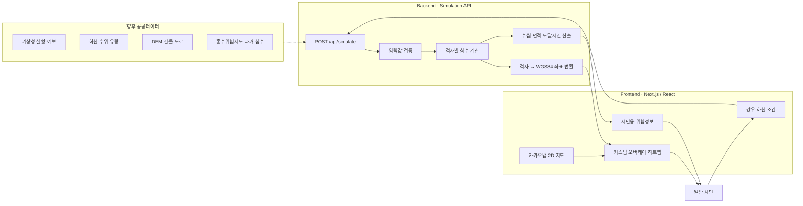

# RIVERSE

> 비가 오기 전, 실제 지도에서 우리 동네의 예상 침수지역을 확인하는 시민용 침수 위험지도

RIVERSE는 일반 시민이 복잡한 재난 데이터를 몰라도 강우와 하천 상황에 따른 **예상 침수지역, 최대 수심, 침수 도달시간, 도로·건물 위험**을 한눈에 확인할 수 있도록 만든 웹 서비스입니다.

현재 MVP는 포항시 냉천 하류의 실제 카카오맵 2D 지도 위에 시뮬레이션 결과를 히트맵으로 표시합니다. 사용자는 비의 세기와 지속시간을 바꾸고 시간에 따라 위험지역이 넓어지는 모습을 확인할 수 있습니다.

## 프로젝트 목표

홍수위험지도, 기상정보, 하천 수위와 같은 재난 정보는 여러 기관에 분산되어 있고 전문 용어가 많습니다. RIVERSE는 이 정보를 시민의 언어와 지도 표현으로 바꾸어 다음 질문에 빠르게 답하는 것을 목표로 합니다.

- 우리 동네에서 어느 지역이 먼저 침수될 수 있을까?
- 도로에 물이 얼마나 깊게 찰 수 있을까?
- 침수가 시작되기까지 얼마나 시간이 남았을까?
- 출퇴근·등하교 전에 피해야 할 위치는 어디일까?
- 비가 더 강해지면 위험 범위가 얼마나 넓어질까?

## 핵심 사용자

- 집중호우가 예상되는 지역 주민
- 출퇴근·등하교 경로를 확인하려는 시민
- 지하주차장, 반지하, 저지대 건물 이용자
- 차량 침수와 도로 통제를 미리 확인하려는 운전자
- 가족이 거주하는 지역의 위험을 대신 확인하려는 보호자

## 현재 구현된 기능

### 실제 2D 지도와 침수 히트맵

- 카카오맵 Web API 기반 실제 도로 지도
- 포항시 냉천 하류의 실제 위·경도 영역 표시
- 카카오맵 `CustomOverlay`를 겹쳐 격자별 예상 수심 히트맵 시각화
- 청록색에서 파란색, 주황색, 빨간색으로 높아지는 위험도 표현
- `1m 이상` 고위험 지점 표시 켜기·끄기
- 클릭 가능한 카카오맵 `Circle` 위험 지점에서 예상 최대 수심과 도달시간 표시
- 지도 확대·축소 및 이동

### 강우·하천 조건 설정

- 시간당 강우량: `10~180 mm/h`
- 강우 지속시간: `30~360분`
- 상류 유량: `100~2,000 ㎥/s`
- 하류 수위: `0~3m`
- 태풍급 복합 홍수와 도심 집중호우 빠른 시나리오

### 시민용 위험 정보

- 종합 침수 위험도 `0~100점`
- 예상 최대 수심과 전체 침수 면적
- 영향을 받을 수 있는 건물 수와 도로 길이
- 최초 침수 예상시간
- 수심 1m 이상 주요 위험 지점
- 지하 공간과 침수 도로에 대한 행동 안내
- 3시간 동안 예상 침수 범위가 변하는 타임라인

## 화면 구성

| 영역 | 시민이 확인하는 내용 |
|---|---|
| 왼쪽 조건 패널 | 강우량, 지속시간, 상류 유량, 하류 수위 |
| 중앙 실제 지도 | 시간대별 침수 히트맵, 1m 이상 위험 지점, 위치별 상세 수심 |
| 오른쪽 결과 패널 | 종합 위험도, 침수 면적, 건물·도로 영향, 행동 안내 |

> JavaScript 키를 설정하지 않은 상태에서는 지도 자리에 설정 안내 화면이 표시됩니다. 키와 도메인을 설정하면 동일한 화면에서 실제 카카오맵이 나타납니다.

## 시스템 아키텍처


```mermaid
flowchart LR
    USER["일반 시민"]

    subgraph FRONTEND["Frontend · Next.js / React"]
        INPUT["강우·하천 조건"]
        KMAP["카카오맵 2D 지도"]
        HEAT["커스텀 오버레이 히트맵"]
        RESULT["시민용 위험정보"]
    end

    subgraph BACKEND["Backend · Simulation API"]
        API["POST /api/simulate"]
        VALIDATE["입력값 검증"]
        MODEL["격자별 침수 계산"]
        GEO["격자 → WGS84 좌표 변환"]
        METRICS["수심·면적·도달시간 산출"]
    end

    subgraph FUTURE["향후 공공데이터"]
        WEATHER["기상청 실황·예보"]
        WATER["하천 수위·유량"]
        TERRAIN["DEM·건물·도로"]
        HISTORY["홍수위험지도·과거 침수"]
    end

    USER --> INPUT --> API
    FUTURE -.-> API
    API --> VALIDATE --> MODEL
    MODEL --> GEO --> HEAT
    MODEL --> METRICS --> RESULT
    KMAP --> HEAT --> USER
    RESULT --> USER
```

## 데이터 처리 흐름

1. 시민이 비와 하천 조건을 선택합니다.
2. 프론트엔드가 조건을 `POST /api/simulate`로 전송합니다.
3. 백엔드가 입력 범위를 검사하고 32×22 격자의 예상 수심과 도달시간을 계산합니다.
4. API가 냉천 하류의 WGS84 지도 경계와 격자 결과를 반환합니다.
5. 프론트엔드가 각 격자를 실제 위·경도 좌표로 변환합니다.
6. 카카오맵 커스텀 오버레이가 수심별 색상과 크기를 적용해 지도 위에 히트맵을 그립니다.
7. 오른쪽 패널에 시민이 이해하기 쉬운 위험 수치와 행동 안내를 표시합니다.

## 기술 구성

| 영역 | 기술 | 역할 |
|---|---|---|
| 웹 프레임워크 | Next.js, React, TypeScript | 시민용 화면과 API 구성 |
| 실제 지도 | 카카오맵 Web JavaScript API | 도로·하천·건물 배경 지도 |
| 지도 연동 | 동적 SDK 로더, React Effect | 카카오맵 생성·정리와 오류 처리 |
| 침수 시각화 | `CustomOverlay`, `Circle` | 수심 히트맵과 선택 가능한 고위험 지점 |
| 백엔드 | Next.js Route Handler | 입력 검증과 격자 침수 계산 |
| 테스트 | Next.js Build, Node.js Test Runner | 타입·빌드·핵심 응답 검증 |

## 프로젝트 구조

```text
GoogleSolution/
├─ app/
│  ├─ api/simulate/route.ts   # 격자 침수 계산 및 지도 영역 API
│  ├─ flood-map.tsx           # 카카오맵과 침수 히트맵
│  ├─ flood-lab.tsx           # 시민용 메인 침수 위험 화면
│  ├─ globals.css             # 전체 UI와 반응형 지도 스타일
│  ├─ layout.tsx              # 메타데이터와 공통 레이아웃
│  └─ page.tsx                # 메인 페이지
├─ tests/
│  └─ rendered-html.test.mjs  # 화면 소스와 API 자동 테스트
├─ .env.example               # 카카오맵 JavaScript 키 예시
├─ presentation.md            # 발표 준비 문서
├─ package.json
└─ README.md
```

## 로컬 실행 방법

### 1. 요구사항

- Node.js `22.13.0` 이상
- npm
- 카카오디벨로퍼스 애플리케이션과 JavaScript 키

### 2. 패키지 설치

```bash
npm install
```

Windows PowerShell에서 `npm` 실행이 차단되면 `npm.cmd install`을 사용합니다.

### 3. 카카오맵 JavaScript 키 설정

프로젝트 루트에서 `.env.example`을 복사해 `.env.local` 파일을 만듭니다.

```env
NEXT_PUBLIC_KAKAO_MAP_JAVASCRIPT_KEY=발급받은_JavaScript_키
```

`.env.local`은 Git에 올라가지 않도록 이미 제외되어 있습니다.

### 4. 개발 서버 실행

```bash
npm run dev
```

브라우저에서 `http://localhost:3000`으로 접속합니다. 환경변수를 변경했다면 서버를 종료한 뒤 다시 실행해야 합니다.

### 5. 빌드와 테스트

```bash
npm run build
npm test
```

## 카카오맵 키 발급 시 사용자가 해야 할 작업

1. [카카오디벨로퍼스](https://developers.kakao.com/)에 로그인하고 애플리케이션을 생성합니다.
2. 앱 관리 화면의 `카카오맵 > 사용 설정`에서 사용 상태를 `ON`으로 변경합니다.
3. `앱 > 플랫폼 키 > JavaScript 키`에서 사용할 키를 확인합니다. REST API 키나 Admin 키가 아닌 **JavaScript 키**가 필요합니다.
4. 해당 JavaScript 키의 `JavaScript SDK 도메인`에 아래 도메인을 등록합니다.
   - 로컬 개발: `http://localhost:3000`
   - 배포 후: `https://실제도메인`
5. JavaScript 키를 `.env.local`의 `NEXT_PUBLIC_KAKAO_MAP_JAVASCRIPT_KEY`에 입력합니다.
6. 개발 서버를 종료한 뒤 다시 실행합니다.

지도 Web SDK의 JavaScript 키는 브라우저가 SDK를 불러올 때 사용되므로 화면 소스에서 확인될 수 있습니다. 따라서 **허용 도메인을 정확히 등록**하고 Admin 키는 절대 프론트엔드에 넣지 않아야 합니다. 키를 README나 Git 저장소에 직접 작성하면 안 됩니다.

카카오맵 무료 쿼터 적용 여부와 유료 사용 조건은 앱 활성화 순서와 사용량에 따라 달라질 수 있으므로 카카오디벨로퍼스의 현재 사용 정책을 확인해야 합니다.

## 시뮬레이션 API

### 요청

`POST /api/simulate`

```json
{
  "rainfall": 110,
  "duration": 180,
  "discharge": 1050,
  "tide": 0.9
}
```

### 주요 응답

```json
{
  "grid": { "width": 32, "height": 22, "cellMeters": 50 },
  "region": {
    "id": "pohang-naengcheon",
    "name": "포항시 냉천 하류",
    "center": { "lat": 35.99035, "lng": 129.4027 },
    "coordinateSystem": "WGS84"
  },
  "metrics": {
    "maxDepth": 1.62,
    "floodedArea": 0.73,
    "affectedBuildings": 5,
    "exposedRoads": 1.6,
    "firstArrivalMinutes": 60,
    "riskScore": 45
  },
  "model": "RIVERSE rapid-grid v0.1"
}
```

실제 응답에는 히트맵을 만들기 위한 704개 격자의 높이, 최대 수심과 침수 도달 단계가 포함됩니다.

## 현재 모델의 범위와 한계

현재 모델은 Google Solution Challenge 시연을 위한 **상대 위험 MVP**입니다.

- 배경은 실제 카카오맵이지만 침수 수심은 실제 관측값이 아닌 가상 50m 격자 계산 결과입니다.
- 냉천 하류 좌표 영역에 계산 격자를 균등하게 투영합니다.
- 실제 DEM, 배수관망, 제방 높이, 건물 높이와 도로 표고는 아직 반영하지 않습니다.
- 실시간 기상청 예보와 하천 관측값을 아직 직접 연동하지 않습니다.
- 화면의 수심과 도달시간은 공식 재난예보가 아닙니다.
- 실제 재난 상황에서는 정부·지자체 재난문자와 도로 통제 안내를 우선해야 합니다.

## 추후 개발 가능한 기능

### 1단계: 실제 데이터 자동 입력

- 기상청 단기예보·초단기실황 API로 현재 지역의 강우 자동 설정
- 홍수통제소 또는 WAMIS 관측 API로 하천 수위와 유량 자동 설정
- 현재 위치와 주소 검색으로 전국 지역 선택
- 과거 침수 이력과 홍수위험지도 GeoJSON 중첩

### 2단계: 예측 정확도 개선

- 국토지리정보원 DEM을 이용한 실제 표고 격자 생성
- 도로, 건물, 제방, 하천 단면과 도시 배수관망 반영
- HEC-RAS 2D 등 수리 모델 결과 연동
- 과거 태풍·집중호우 관측 결과로 모델 보정
- 여러 강우 시나리오를 계산해 단일 수심이 아닌 침수 확률 표시

### 3단계: 시민 안전 서비스

- 내 위치 주변 침수 위험 푸시 알림
- 침수 도로를 제외한 안전 이동경로
- 가까운 대피소, 병원과 고지대 위치 표시
- 차량·보행자별 위험 수심 안내
- 가족이 등록한 지역의 위험 알림
- 큰 글씨, 고대비, 음성 안내 등 접근성 강화

### 4단계: 운영 준비

- 계산 결과 캐시와 지역별 사전 시나리오 생성
- 실시간 데이터 장애 시 대체 데이터와 최신 갱신 시각 표시
- 관리자용 데이터 품질·예측 오차 대시보드
- 재난기관 검증, 개인정보 보호, API 사용량과 비용 모니터링

## 다음 개발에 추가로 필요한 API·데이터

| 우선순위 | API·데이터 | 필요한 이유 | 사용자 준비 사항 |
|---|---|---|---|
| 필수 | 카카오맵 Web API | 실제 2D 지도 표시 | 카카오 앱 생성, 지도 사용 설정, JavaScript 키와 도메인 등록 |
| 높음 | 기상청 API 허브 | 실황·예보 강우 자동 입력 | 활용 신청 및 인증키 |
| 높음 | WAMIS·홍수통제소 관측정보 | 하천 수위·유량 반영 | 제공 방식과 지점 코드 확인 |
| 높음 | 국토지리정보원 DEM | 실제 지형 높이 반영 | 대상 지역 수치표고모델 확보 |
| 중간 | 홍수위험지도·과거 침수 이력 | 모델 보정과 참고 레이어 | 공공데이터 이용 조건 확인 |
| 중간 | 대피소·도로 통제 데이터 | 안전 이동과 행동 안내 | 지자체·공공데이터 API 확인 |

## 공식 참고 문서

- [카카오맵 Web API 시작 가이드](https://apis.map.kakao.com/web/guide/)
- [카카오맵 Web API 문서](https://apis.map.kakao.com/web/documentation/)
- [카카오맵 API 사용 설정과 키 종류](https://developers.kakao.com/docs/ko/kakaomap/common)
- [카카오 JavaScript 키와 SDK 도메인 설정](https://developers.kakao.com/docs/ko/app-setting/app)

## 관련 지속가능발전목표

- **SDG 11 — 지속가능한 도시와 공동체:** 시민이 생활권의 재난 위험을 쉽게 이해하고 더 빠르게 대비하도록 지원합니다.
- **SDG 13 — 기후행동:** 극한호우가 증가하는 환경에서 지역별 기후재난 적응을 돕습니다.

## 핵심 메시지

RIVERSE는 전문가만 이해할 수 있는 재난 데이터를 시민의 언어로 바꾸어, **비가 오기 전에 실제 지도에서 우리 동네의 위험지역을 미리 확인하고 대비하도록 돕는 서비스**입니다.
