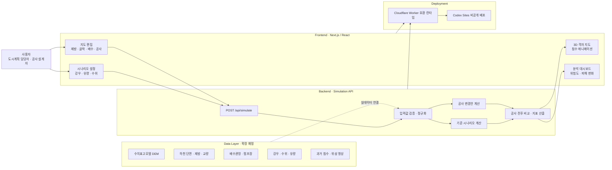
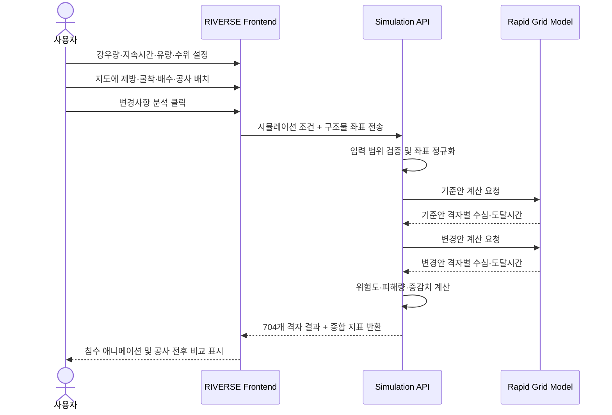
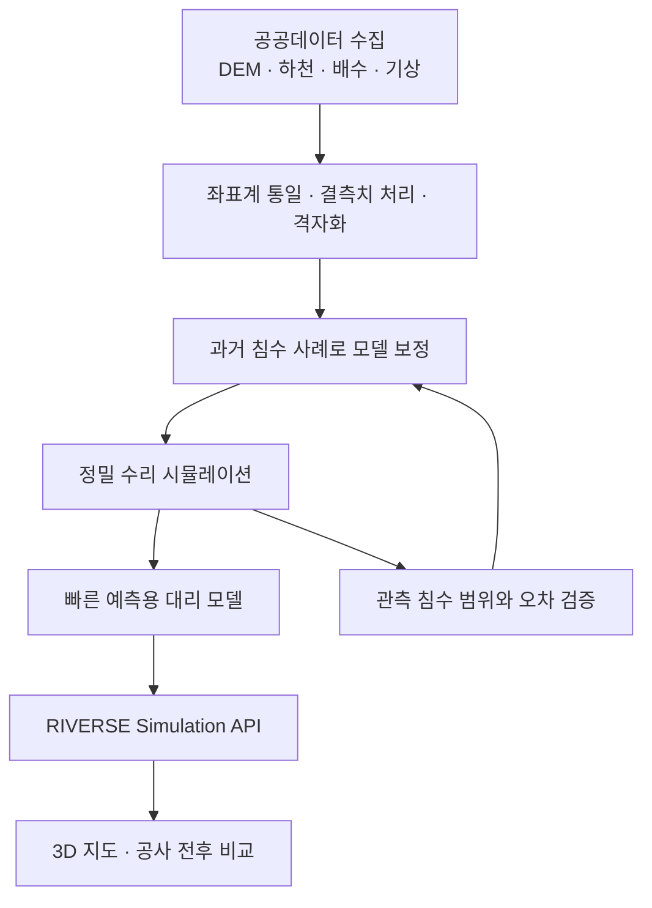
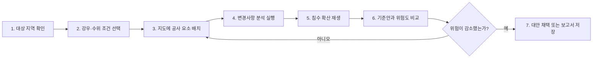

# RIVERSE 발표 자료

> 공사 전에 도시의 물길을 바꿔보고, 침수 위험의 변화를 비교하는 도시 수해 디지털 트윈

---

## 3. 아키텍처 설계도

### 3-1. 전체 시스템 아키텍처

RIVERSE는 **사용자 조작 영역**, **침수 계산 영역**, **데이터 영역**, **결과 시각화 영역**을 분리한다. 현재 MVP는 빠른 시연을 위해 자체 격자 모델을 사용하며, 이후 실제 공공데이터와 정밀 수리 모델을 연결할 수 있도록 설계한다.



#### 현재 MVP와 최종 목표의 차이

| 구분 | 현재 MVP | 최종 목표 |
|---|---|---|
| 지형 | 냉천 하류를 가정한 50m 격자 | 국토지리정보원 DEM 기반 실제 지형 |
| 강우·수위 | 사용자가 직접 조건 입력 | 기상청·WAMIS 실시간/과거 데이터 연동 |
| 침수 계산 | 빠른 상대위험 격자 모델 | HEC-RAS 2D 또는 검증된 수리 모델 |
| 지도 | Canvas 기반 등각 3D 지도 | Google 3D Tiles/Cesium 기반 실제 도시 |
| 결과 | 최대 수심, 면적, 건물·도로 영향 | 유속, 도달시간, 취약시설, 경제 피해까지 확장 |
| 용도 | 아이디어와 사용자 경험 검증 | 도시계획 의사결정 지원 및 사전 영향 분석 |

> **발표 시 강조점:** 현재 모델을 공식 재난 예측 모델로 주장하지 않는다. MVP의 핵심 가치는 공사 전후 위험 변화를 직관적으로 비교하는 사용자 경험과 확장 가능한 구조에 있다.

---

### 3-2. 데이터 흐름도

#### 현재 구현된 데이터 흐름



#### 입력 데이터

| 데이터 | 형식 | 현재 범위 | 역할 |
|---|---|---:|---|
| 시간당 강우 | mm/h | 10~180 | 유역에 유입되는 물의 양 결정 |
| 강우 지속시간 | 분 | 30~360 | 누적 유출량 결정 |
| 상류 유량 | ㎥/s | 100~2,000 | 하천 범람 압력 결정 |
| 하류 수위 | m | 0~3 | 하천 배수 지연과 역류 영향 반영 |
| 공사 요소 | 종류 + 격자 좌표 | 최대 16개 | 제방, 굴착, 배수구, 통수 차단 효과 반영 |

#### 계산 과정

1. 입력값의 허용 범위를 검사하고 비정상 요청을 차단한다.
2. 32×22, 총 704개 격자에 지형 높이와 하천까지의 거리를 설정한다.
3. 강우·유량·수위를 결합해 각 격자의 기본 침수 압력을 계산한다.
4. 제방·굴착·배수구·공사 차단의 거리별 영향을 반영한다.
5. 공사 요소가 없는 **기준 시나리오**와 사용자가 편집한 **변경 시나리오**를 각각 계산한다.
6. 두 결과를 비교해 위험도와 예상 피해 증감치를 생성한다.

#### 출력 데이터

| 출력 | 설명 | UI 표현 |
|---|---|---|
| 격자별 최대 수심 | 각 위치에서 예상되는 최대 물 깊이 | 청록→남색 침수 색상 |
| 침수 도달 단계 | 최초 침수가 시작되는 시간 단계 | 3시간 타임라인 애니메이션 |
| 종합 위험도 | 침수 면적과 최대 수심을 조합한 0~100 점수 | 위험도 게이지 |
| 침수 면적 | 0.15m 이상 침수된 격자의 총면적 | ㎢ 지표 |
| 영향 건물 | 0.2m 이상 침수된 건물 수 | 동 단위 지표 |
| 노출 도로 | 침수된 주요 도로 격자의 길이 | km 단위 지표 |
| 피해액 변화 | 기준안과 변경안의 상대적 피해 차이 | 억 원 증감 표시 |

#### 향후 실데이터 흐름



---

### 3-3. UI/UX 화면 구성

#### 전체 화면 구조

```text
┌──────────────────────────────────────────────────────────────────────────────┐
│ RIVERSE │ 시나리오: 냉천 산업지구 공사 영향 분석 │ 초기화 │ 변경사항 분석 │
├───────────────┬────────────────────────────────────────┬─────────────────────┤
│ ① 조건 설정   │ ② 3D 침수 시뮬레이션 지도             │ ③ 분석 결과          │
│               │                                        │                     │
│ 강우량        │ [조회][제방][굴착][배수][공사][취소]  │ 종합 위험도          │
│ 지속시간      │                                        │ 최대 수심            │
│ 상류 유량     │      도시·하천·침수 영역               │ 침수 면적            │
│ 하류 수위     │      공사 요소 직접 배치               │ 영향 건물·도로       │
│               │                                        │                     │
│ 빠른 시나리오 │                                        │ 공사 전후 비교       │
│ · 태풍 복합   │                                        │ 우선 확인 지점       │
│ · 집중호우    │                                        │                     │
├───────────────┴────────────────────────────────────────┴─────────────────────┤
│                 재생 │ 00:00 ━━━━━●━━━━ 03:00 │ 수심 범례                │
└──────────────────────────────────────────────────────────────────────────────┘
```

#### 영역별 역할

| 영역 | 핵심 목적 | 주요 인터랙션 | 사용자가 얻는 답 |
|---|---|---|---|
| 상단 헤더 | 현재 분석 대상과 실행 상태 인지 | 초기화, 분석 실행 | “지금 어떤 지역과 시나리오를 보고 있는가?” |
| 좌측 조건 패널 | 재난 조건 설정 | 슬라이더, 프리셋 선택 | “어느 정도의 비와 하천 상황을 가정했는가?” |
| 중앙 3D 지도 | 공사안 편집 및 침수 확산 확인 | 지도 클릭, 도구 선택, 재생 | “어디를 바꾸면 물이 어디로 이동하는가?” |
| 우측 분석 패널 | 결과와 위험 변화 요약 | 기준안·변경안 비교 | “이 공사가 위험을 얼마나 늘리거나 줄이는가?” |
| 하단 타임라인 | 시간에 따른 침수 과정 확인 | 재생, 일시정지, 구간 이동 | “침수가 언제 시작되고 얼마나 퍼지는가?” |

#### 핵심 사용자 여정



#### UX 설계 원칙

- **비교 우선:** 단순히 침수 여부만 보여주지 않고 기준안 대비 위험 증감을 가장 먼저 제시한다.
- **직접 조작:** 복잡한 수리 모델 입력 대신 사용자가 지도 위에 공사 요소를 배치한다.
- **시간 표현:** 정적인 침수지도 대신 물이 확산되는 순서를 애니메이션으로 보여준다.
- **위험 색상 일관성:** 낮은 수심은 청록, 깊은 수심은 남색, 경고는 주황으로 구분한다.
- **과장 방지:** 화면에 MVP 수리 모델임을 명시하고 공식 방재 판단용 모델과 구분한다.
- **반복 탐색:** 결과가 좋지 않으면 바로 지도로 돌아가 다른 대안을 시험할 수 있다.

---

## 4. 최종 발표 전까지 남은 작업

### 4-1. 우선순위별 작업

#### P0 — 발표 전에 반드시 완료

- [ ] **데모 시나리오 확정**
  - 기준안, 위험 증가안, 위험 감소안 총 3개 시나리오 준비
  - 각 시나리오의 입력값과 지도 클릭 위치를 문서화
  - 인터넷 지연에 대비한 결과 화면 캡처 또는 데모 영상 준비

- [ ] **모델 결과 검증**
  - 강우량·유량을 높이면 위험도가 증가하는지 확인
  - 제방·배수·굴착은 위험을 낮추고 통수 차단은 상류 위험을 높이는지 확인
  - 극단 입력값과 잘못된 API 요청에서도 오류가 발생하지 않는지 확인

- [ ] **과거 사례 기반 스토리 구성**
  - 특정 사고 원인을 단정하지 않고 “공사·구조 변경 전 영향 검토 부족” 문제로 정의
  - 사고 전, 변경안 분석, 위험 발견, 대안 적용의 흐름으로 발표 구성
  - 실제 사건 자료에는 반드시 출처와 발생일 표기

- [ ] **공공데이터 최소 1종 연결 또는 샘플 적용**
  - 우선순위: 실제 DEM → 실제 강우 → 홍수위험지도 순서
  - 실시간 연결이 어렵다면 대상 지역 데이터 일부를 전처리해 정적 파일로 적용
  - 현재 가상 지형과 실제 데이터를 화면에서 명확히 구분

- [ ] **발표용 수치와 표현 점검**
  - 피해액은 “예상 상대 피해액”임을 명시
  - 위험도 점수 산정 방식을 한 문장으로 설명 가능하게 정리
  - 공식 재난 예측이나 실제 안전 보장을 의미하는 표현 제거

- [ ] **최종 데모 리허설**
  - 발표자 조작 순서와 설명 문장을 맞춰 최소 3회 반복
  - 발표용 노트북과 행사 네트워크 환경에서 사이트 접속 확인
  - 브라우저 확대율, 해상도, 글자 가독성 확인

#### P1 — 완성도를 크게 높이는 작업

- [ ] Google Maps Platform 또는 Cesium을 이용한 실제 3D 지역 배경 적용
- [ ] 국토지리정보원 DEM을 계산용 격자로 변환하는 전처리 파이프라인 제작
- [ ] 분석 시나리오 저장·불러오기 및 공유 링크 기능
- [ ] 공사 요소를 점이 아닌 선·면으로 그리는 편집 도구
- [ ] 분석 결과를 PDF 또는 이미지 보고서로 내보내는 기능
- [ ] 침수 취약 건물과 주요 도로를 지도에서 직접 강조
- [ ] 모바일 화면과 발표용 대형 화면에서 최종 사용성 점검

#### P2 — 시간이 남을 경우 진행

- [ ] Google Earth Engine을 이용한 과거 위성 침수 범위 추출
- [ ] HEC-RAS 결과를 학습한 빠른 AI 대리 모델 실험
- [ ] 다수의 강우 시나리오를 실행한 침수 확률 표현
- [ ] 대피소·병원·학교 등 취약시설 영향 분석
- [ ] 여러 공사 대안을 자동으로 비교하고 최적안을 추천하는 기능
- [ ] Firebase를 이용한 팀 프로젝트·시나리오 협업 기능

---

### 4-2. D-Day 역산 일정

발표일까지 남은 기간에 맞춰 아래 일정을 압축해서 적용한다.

| 시점 | 핵심 작업 | 완료 기준 |
|---|---|---|
| D-14 ~ D-10 | 데이터와 모델 검증 | 데모 지역·입력값 확정, 실제 데이터 1종 적용 |
| D-9 ~ D-7 | 핵심 기능 보완 | 3개 데모 시나리오가 오류 없이 재현됨 |
| D-6 ~ D-5 | 발표 자료 제작 | 문제·해결·기술·효과·한계가 하나의 이야기로 연결됨 |
| D-4 ~ D-3 | 데모 영상과 백업 준비 | 90초 내외 백업 영상과 주요 화면 캡처 완료 |
| D-2 | 전체 발표 리허설 | 제한 시간 이내 발표, 팀원 간 전환 실수 없음 |
| D-1 | 안정화만 진행 | 새로운 기능 추가 중단, 치명적 오류만 수정 |
| D-Day | 최종 점검 | 링크, 로그인, 화면 비율, 영상 재생 확인 |

---

### 4-3. 3분 데모 진행안

| 시간 | 화면·행동 | 설명 핵심 |
|---:|---|---|
| 0:00~0:20 | RIVERSE 첫 화면 | “도시 공사 전에 침수 영향을 비교하는 디지털 트윈입니다.” |
| 0:20~0:45 | 강우·유량 조건 설정 | 태풍급 복합 홍수 조건을 빠르게 설정 |
| 0:45~1:20 | 지도에 공사 차단 배치 | 공사로 통수 단면이 감소하는 가상 상황 생성 |
| 1:20~1:45 | 분석 실행 및 침수 재생 | 물이 상류와 저지대로 퍼지는 과정 설명 |
| 1:45~2:10 | 위험도·피해 변화 확인 | 기준안 대비 위험 증가를 정량적으로 제시 |
| 2:10~2:35 | 제방·배수 대안 적용 | 다른 대안을 즉시 시험하고 위험 감소 확인 |
| 2:35~3:00 | 확장 아키텍처 제시 | 실제 DEM·기상·수리 모델 연결 계획과 기대효과 설명 |

---

### 4-4. 예상 위험과 대응책

| 위험 | 발표에 미치는 영향 | 대응책 |
|---|---|---|
| 실제 데이터 부족 | 결과 신뢰성에 대한 질문 | MVP와 정밀 모델을 구분하고 실제 데이터 연결 계획 제시 |
| 계산 결과 과장 | 심사위원의 신뢰 하락 | 상대 위험 분석임을 명시하고 공식 예측 표현 금지 |
| 인터넷 또는 배포 장애 | 라이브 데모 중단 | 로컬 실행 환경, 녹화 영상, 화면 캡처 3중 준비 |
| 지도 조작 실수 | 시나리오 재현 실패 | 클릭 위치가 정해진 데모 스크립트와 초기화 절차 준비 |
| 발표 시간 초과 | 핵심 가치 전달 실패 | 기술 설명보다 문제→비교→효과의 3단계 흐름 우선 |
| 특정 사고 원인 단정 | 사실관계 및 윤리 문제 | 가상 시나리오로 표현하고 공신력 있는 자료만 인용 |

---

### 4-5. 최종 완료 기준

아래 항목이 모두 충족되면 발표 준비가 끝난 것으로 판단한다.

- [ ] 사이트 접속 후 10초 안에 서비스 목적을 이해할 수 있다.
- [ ] 사용자가 도움 없이 강우 조건과 공사 요소를 변경할 수 있다.
- [ ] 기준안과 변경안의 위험도 차이가 명확하게 표시된다.
- [ ] 최소 3개의 시나리오가 같은 결과로 반복 재현된다.
- [ ] 실제 데이터 출처, 모델 한계, 향후 검증 방법이 발표 자료에 포함된다.
- [ ] 라이브 데모가 실패해도 동일한 내용을 보여주는 백업 영상이 있다.
- [ ] 발표와 데모가 전체 제한 시간 안에 끝난다.
- [ ] 마지막 한 문장으로 서비스의 가치를 설명할 수 있다.

> **마무리 메시지:** RIVERSE는 홍수가 발생한 뒤 피해를 보여주는 지도가 아니라, 도시를 바꾸기 전에 물이 어떻게 움직일지를 먼저 시험하는 의사결정 도구이다.
